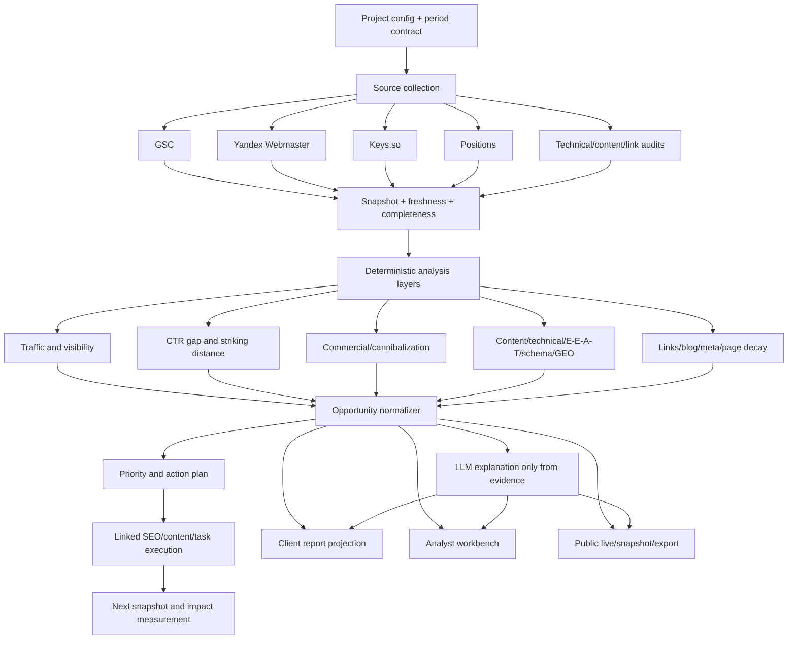

# Техническое задание: единый Projects → Growth Analysis → Reports pipeline

**Проект:** `krasuhod-lang/generator1`  
**Документ:** `TECHNICAL_TASK_PROJECTS_REPORTS_UNIFIED_GROWTH_PIPELINE.md`  
**Статус:** к внедрению  
**Приоритет:** P0/P1  
**Цель:** превратить разделы «Проекты» и «Отчёты» в единый аналитический организм, где факты из подключённых источников превращаются в проверяемые точки роста, затем — в план действий, связанные SEO/content-задачи и клиентский отчёт без расхождений между экраном аналитика, превью, публичной ссылкой и экспортом.

> **Главный принцип:** детерминированные данные и evidence являются источником истины; LLM только объясняет, группирует и формулирует выводы по уже подтверждённым данным. Модель не имеет права создавать метрики, причинность, прогнозные числа, источники или обещания, которых нет в evidence.

---

## 1. Контекст и текущая архитектура

В текущей системе Projects уже собирает значительный объём данных: Google Search Console, Яндекс.Вебмастер, Keys.so, съём позиций, коммерческий анализ, каннибализацию, сравнение периодов, page decay, брендовый/небрендовый трафик, сезонность, аудит мета-тегов, ссылочную стратегию, E-E-A-T, schema, blog plan, GEO/AEO, top-page insights и action plan. Основная логика находится в `backend/src/services/projects/analysisRunner.js`.

Smart Reports собирает другой слой данных в `backend/src/services/reports/dataAggregator.js`: KPI, графики, источники, задачи, модули, top pages/queries, traffic value, forecast, headline и ручные overrides. Отчёт выводится через `frontend/src/components/reports/ReportRenderer.vue`, а AI summary создаётся в `backend/src/services/reports/aiAnalyst.js`.

Сейчас эти два слоя связаны недостаточно жёстко. Projects analysis сохраняется в `project_analyses` и snapshots, но Smart Report не обязан автоматически использовать последний completed analysis. В результате клиент может получить графики и AI-резюме без тех growth-модулей, которые уже были рассчитаны в Projects. При этом `ReportRenderer.vue` не содержит отдельного отображения `data.modules`, `striking_distance`, `ctr_gap`, `content_health`, `off_page`, `tech_audit` и `client_safe_summary`.

Кроме того, фоновые анализы Projects и AI summary Reports запускаются через `setImmediate`. Это создаёт риск зависших `queued/running` записей после перезапуска сервера, тогда как для генератора контента уже существует более строгая durable task/recovery архитектура.

---

## 2. Найденные слабые места

### 2.1. Критические P0-проблемы

| ID | Проблема | Последствие | Требуемое решение |
|---|---|---|---|
| P0-01 | `startAnalysis` и `generateSummaryEndpoint` используют `setImmediate`, а не durable job с lease/heartbeat/recovery | После рестарта сервера анализ или AI summary могут остаться в `queued/running` навсегда | Перевести оба процесса на существующий durable task/outbox/BullMQ-паттерн; добавить startup recovery и reconciler |
| P0-02 | Projects analysis не является обязательным источником для Reports | В проекте и клиентском отчёте могут отображаться разные точки роста | Ввести единый `analysis_snapshot_id` и нормализованный growth payload, который используется всеми представлениями |
| P0-03 | Growth modules считаются backend, но не отображаются в основном Smart Report | Клиент не видит striking distance, CTR gaps, content health, технические и ссылочные точки роста | Добавить отдельный блок «Точки роста» в client и analyst режимах |
| P0-04 | AI prompt просит минимизировать негатив, называть причины вроде сезонности/алгоритмов/конкурентов без evidence и одновременно запрещает выдумывать числа | Возможны убедительные, но неподтверждённые causal claims и позитивный bias | Разделить `observed_fact`, `hypothesis`, `recommendation`; причинность без evidence маркировать гипотезой или не показывать клиенту |
| P0-05 | Client mode является в основном sanitization/field stripping, а не отдельной клиентской моделью | Клиент получает длинный analyst-like отчёт и должен сам собирать смысл | Создать client-first report projection: result → reason → opportunity → action → success metric |

### 2.2. Высокоприоритетные P1-проблемы

| ID | Проблема | Последствие | Требуемое решение |
|---|---|---|---|
| P1-01 | `flushSummary` сохраняет не все AI-поля: отсутствуют `llm_growth`, `llm_vulnerabilities`, `llm_roadmap` | Ручные правки блоков могут теряться перед публикацией | Сохранять полный versioned summary contract одним PATCH или отдельными атомарными секциями |
| P1-02 | Publish UI не передаёт `view_mode`, хотя preview переключается между analyst/client | Публичная ссылка может отличаться от выбранного режима превью | Добавить явный выбор `client/analyst` в публикацию; для клиента default = client |
| P1-03 | `llm_growth` хранится как TEXT, другие поля — JSONB | Сложнее валидировать, сортировать, версионировать и использовать в аналитике | Ввести canonical JSONB `report_insights` с backward-compatible migration |
| P1-04 | Insight не имеет единого evidence ID, confidence, freshness, URL/query, formula и success metric | Невозможно проверить, откуда взялся вывод и как измерять результат | Создать `project_growth_opportunities` и provenance contract |
| P1-05 | Tasks/SEO/content generation не связаны с opportunity | Нельзя показать клиенту, какая работа выполняется ради конкретной точки роста | Добавить `opportunity_id`, `analysis_id`, `source_snapshot_id` и expected metric в task metadata |
| P1-06 | Live/snapshot report не имеет полноценной версии аналитического снимка | Нельзя воспроизвести, на каких данных был построен опубликованный отчёт | Хранить `snapshot_id`, `analysis_id`, `report_model_version`, `data_freshness` и `generated_at` |
| P1-07 | Google и Яндекс сопоставляются полезно, но некоторые рекомендации используют чрезмерно общие предпосылки | Рекомендации могут быть неверны для региона/ниши | Все cross-engine claims должны иметь локальное evidence; убрать универсальные фразы вроде «доля Яндекса часто 40–60%» без источника |

### 2.3. UX/P2-проблемы

В списке Reports отображаются название, проект, период, статус и AI-индикатор, но нет свежести источников, completeness, последнего growth score, количества открытых возможностей и даты последнего анализа. В списке Projects также видны подключения, но не видны health status, последний полный период, незакрытые high-priority opportunities и наличие актуального клиентского отчёта.

Публичный отчёт должен сразу отвечать на пять вопросов: что изменилось, почему это произошло, где ближайший потенциал, что будет сделано и как будет измерен результат. Сейчас клиент сначала видит несколько разрозненных графиков, а рекомендации и AI-analysis находятся ниже и не всегда связаны с конкретной страницей, запросом или задачей.

---

## 3. Целевой единый pipeline

Целевой поток должен быть единым для Projects, Reports, SEO tasks, content generation, meta-tags, link articles, blog articles и position tracking.



### 3.1. Stage 0 — Project and period contract

Перед сбором данных система создаёт единый `analysis_run` с `project_id`, `from`, `to`, `granularity`, `requested_at`, `requested_by`, `run_id` и `model_version`. Все последующие запросы и задачи используют этот run ID.

Периоды должны быть классифицированы как `complete`, `partial`, `stale` или `unavailable`. Последний неполный месяц не должен участвовать в headline delta без явной маркировки. Источник истины для дат — snapshot metadata, а не дата открытия отчёта.

### 3.2. Stage 1 — Source collection

Каждый источник собирается независимо и сохраняется с собственным статусом:

```json
{
  "source": "gsc",
  "status": "ok|partial|empty|error|stale",
  "captured_at": "2026-08-20T10:00:00.000Z",
  "source_max_date": "2026-08-19",
  "requested_from": "2026-05-01",
  "requested_to": "2026-07-31",
  "rows": 1234,
  "error_code": null,
  "snapshot_id": "uuid"
}
```

Ошибка одного источника не должна удалять данные другого, но каждое утверждение в клиентском отчёте должно знать, какие источники были доступны.

### 3.3. Stage 2 — Normalization and data quality

Нормализатор должен выравнивать даты, валюту traffic value, CTR units, positions, query case, URLs, source labels и completeness. Нельзя сравнивать Google и Яндекс как одну метрику без явного обозначения поисковой системы.

Должен рассчитываться `data_confidence`:

| Уровень | Условие |
|---|---|
| `high` | Основные источники доступны, период завершён, свежесть в пределах настройки, нет существенных пропусков |
| `medium` | Один из вторичных источников недоступен или есть частичный период, но основные KPI пригодны |
| `low` | Есть только один источник, данные устарели или период неполный |
| `insufficient` | Нет источника, достаточного для вывода |

### 3.4. Stage 3 — Deterministic analysis

В эту стадию переносятся и нормализуются уже существующие слои `analysisRunner`: period compare, page decay, brand split, seasonality, commercial, serp verification, page meta audit, link audit, E-E-A-T, schema, blog plan, GEO/AEO, top-page insights и modules.

Каждый слой должен возвращать не только human-readable summary, но и машинный массив evidence records. Markdown остаётся presentation format, но не источником данных.

### 3.5. Stage 4 — Opportunity normalizer

Все точки роста переводятся в единый объект:

```json
{
  "opportunity_id": "stable-hash(project_id|type|url|query|period)",
  "project_id": "uuid",
  "analysis_id": "uuid",
  "snapshot_id": "uuid",
  "category": "striking_distance|ctr_gap|content|technical|commercial|cannibalization|links|meta|eeat|schema|geo|blog|position",
  "title": "Усилить страницу /catalog/filter под запрос ...",
  "status": "open|planned|in_progress|done|dismissed|measured",
  "priority": "critical|high|medium|low",
  "priority_score": 82.4,
  "target": { "url": "https://example.com/page", "query": "...", "engine": "google" },
  "current": { "position": 12.4, "clicks": 84, "impressions": 4200, "ctr": 2.0 },
  "target_metric": { "name": "clicks", "value": 120, "horizon_days": 30 },
  "impact": { "type": "potential_clicks|visibility|ctr|technical_risk", "value": 36, "unit": "clicks_per_month" },
  "effort": "low|medium|high",
  "confidence": 0.86,
  "observed_fact": "Страница получает 4 200 показов при CTR 2.0%.",
  "hypothesis": "Низкий CTR может быть связан с недостаточно конкретным сниппетом; это гипотеза до A/B/period validation.",
  "recommended_action": "Перепроверить intent и обновить title/description без изменения подтверждённых фактов.",
  "success_metric": "CTR и клики по тому же URL/query за следующий полный период",
  "evidence": [
    { "source": "gsc", "field": "impressions", "value": 4200, "captured_at": "2026-08-20T10:00:00.000Z" }
  ],
  "linked_task_ids": [],
  "created_at": "2026-08-20T10:00:00.000Z",
  "last_seen_at": "2026-08-20T10:00:00.000Z"
}
```

`opportunity_id` должен быть стабильным между анализами, чтобы система могла отслеживать lifecycle одной точки роста, а не создавать новую запись каждый месяц.

### 3.6. Stage 5 — Priority and action plan

Приоритет должен быть объяснимым и настраиваемым. Базовая формула:

```text
priority_score =
  0.45 × normalized_impact
+ 0.25 × confidence
+ 0.15 × urgency
+ 0.15 × (1 - normalized_effort)
```

Коэффициенты должны храниться в конфигурации проекта и покрываться тестами. Если данных для impact нет, система не должна подменять их выдуманным финансовым эффектом; opportunity получает `impact_unknown` и более низкую confidence.

Action plan обязан отвечать на вопрос: **что сделать, для какой страницы/запроса, почему сейчас, кто выполняет, какой показатель изменится и когда проверить эффект**.

### 3.7. Stage 6 — LLM explanation layer

LLM получает только:

1. normalized metrics;
2. evidence records;
3. selected opportunities;
4. completed task records;
5. data quality and freshness metadata;
6. brand/project context.

LLM возвращает JSON по схеме с полями `observed_facts`, `hypotheses`, `recommendations`, `risks`, `confidence_notes`, `executive_summary`. Любой causal statement без evidence должен получить `claim_type=hypothesis` и не может быть показан как подтверждённая причина.

Запрещено автоматически писать клиенту: «алгоритм Google изменился», «конкуренты усилились», «рост гарантирован», «получим N рублей», если соответствующее утверждение не подтверждено источником или явно не отмечено как сценарная гипотеза.

Forecast должен быть либо детерминированным блоком с формулой и диапазоном, либо качественным сценарным текстом. В одном контракте нельзя одновременно запрещать модели считать числа и требовать от неё придумать числовой прогноз.

### 3.8. Stage 7 — Report projections

Один normalized payload должен проецироваться в три режима:

| Режим | Содержимое |
|---|---|
| `client` | Executive summary, KPI, data confidence, top opportunities, actions, expected metric, completed impact, next check, short methodology |
| `analyst` | Все client-блоки плюс raw tables, source diagnostics, formulas, overrides, full module details, AI telemetry и evidence drill-down |
| `export` | Тот же client/analyst projection с фиксированным snapshot, источниками, датами, methodology и page breaks |

Нельзя собирать отдельные и потенциально противоречивые версии для preview, public link, PDF и DOCX. Все они должны использовать один backend projection с `report_model_version`.

---

## 4. Целевой клиентский отчёт

### 4.1. Первый экран

Первый экран должен содержать:

| Блок | Содержание |
|---|---|
| Период и свежесть | Период, дата последнего сбора, complete/partial, источники |
| Data confidence | High/Medium/Low/Insufficient с коротким объяснением |
| Executive result | Что изменилось: 3–5 подтверждённых KPI-фактов |
| Business interpretation | Что это означает для видимости/трафика без неподтверждённого обещания продаж |
| Top opportunities | Три наиболее приоритетные возможности с URL/query, impact, confidence и effort |
| Next actions | Что будет сделано в ближайшие 7/30 дней и какой KPI проверяется |

### 4.2. Основные секции

1. **Результат периода.** Показываются completed-month KPI и прозрачные дельты. Неполный месяц выводится отдельно и не смешивается с основной динамикой.

2. **Точки роста.** Для каждой возможности показываются evidence, affected URL/query, поисковая система, текущий показатель, потенциальный эффект, приоритет, действие и success metric.

3. **Что было сделано и какой эффект измеряется.** Работы связываются с opportunity ID. Если эффект ещё не измерен, показывается `awaiting_measurement`, а не утверждение о результате.

4. **План на следующий период.** Группировка по 7/30/90 дням с owner/status/expected metric.

5. **Источники и ограничения.** Краткий блок о подключениях, свежести, частичных данных и методике. Подробности доступны через раскрытие.

6. **Детали.** Графики, top pages, queries, Google/Яндекс comparison, technical/content/link audits доступны ниже и не должны затруднять понимание executive части.

### 4.3. Analyst mode

Analyst mode сохраняет полный набор модулей, raw rows, formulas, source diagnostics, manual overrides, AI status, prompt/model metadata и возможность редактировать narrative. При изменении override система должна показывать, какие derived insights стали stale и требуют пересчёта.

---

## 5. Изменения в Projects

На карточке проекта необходимо показывать:

| Поле | Назначение |
|---|---|
| Последний completed analysis | Понимание актуальности аналитики |
| Data confidence | Быстрая оценка качества входных данных |
| Последний полный период | Отсутствие ошибочной трактовки текущего месяца |
| Open opportunities | Количество critical/high/medium |
| Opportunity impact | Суммарный подтверждённый или proxy impact без выдачи его за выручку |
| Active report | Ссылка на последний draft/public report |
| Task execution | Сколько opportunities planned/in_progress/done |

На ProjectDetailPage кнопка «Отчёт проекта» должна не только открыть последний draft, но и предложить: `Создать из последнего анализа`, `Обновить snapshot`, `Открыть client preview`, `Открыть analyst view`.

После завершения Projects analysis система должна автоматически обновлять linked report draft только при явном режиме `auto_sync=true`; ручные блоки и overrides не должны перезаписываться молча.

---

## 6. Изменения в Reports

### 6.1. Backend

`aggregateForDraft` должен получать latest completed `analysis_id/snapshot_id` по проекту и периоду, если draft не зафиксирован на конкретном snapshot. Для snapshot report используется immutable snapshot; для live report берётся последний совместимый completed snapshot.

Добавить в payload:

```json
{
  "analysis": {
    "id": "uuid",
    "status": "completed",
    "completed_at": "2026-08-20T10:00:00.000Z",
    "model_version": "projects-analysis-v2"
  },
  "data_quality": {
    "confidence": "high",
    "sources": [],
    "warnings": []
  },
  "growth_overview": {
    "headline": {},
    "kpis": [],
    "top_opportunities": [],
    "open_count": 12,
    "measured_count": 4
  },
  "opportunities": [],
  "actions": [],
  "provenance": {
    "snapshot_id": "uuid",
    "analysis_id": "uuid",
    "report_model_version": "reports-v2",
    "generated_at": "2026-08-20T10:00:00.000Z"
  }
}
```

### 6.2. Frontend

В `ReportRenderer.vue` добавить компонент `GrowthOverviewCard` и отдельные `OpportunityTable`/`OpportunityCard`. Он должен использовать уже backend-normalized records, а не пересчитывать priority или причинность во Vue.

В `ReportEditorPage.vue`:

- сохранять все AI/insight поля, включая growth, vulnerabilities, roadmap и opportunity ordering;
- показывать `unsaved changes` и завершать debounce flush перед export/publish;
- добавить режим публикации `client/analyst`;
- показывать snapshot/live и source freshness в модальном окне;
- запрещать публикацию при `data_confidence=insufficient`, если пользователь явно не подтвердил публикацию неполного отчёта;
- показывать stale warning после ручного override до пересчёта derived insights.

В `ReportsPage.vue` добавить колонки `последний анализ`, `свежесть`, `data confidence`, `high opportunities`, `AI status`, `report status` и фильтры по проекту/статусу.

---

## 7. Durable jobs and recovery

### 7.1. Project analysis job

Заменить `setImmediate(() => processAnalysis(...))` на durable job:

```text
project-analysis queue
  job_id = stable(project_id + analysis_id)
  lease_token
  worker_id
  heartbeat_at
  checkpoint
  attempt
  max_attempts
  status = queued|running|completed|failed|manual_review
```

Worker должен сохранять checkpoints после source collection, normalization, deterministic layers, opportunity normalization and synthesis. При restart startup recovery возвращает просроченные leases в очередь; reconciler сравнивает DB state и BullMQ state.

### 7.2. Report AI summary job

`report_drafts.llm_status` должен обновляться через durable job с `llm_job_id`, `started_at`, `heartbeat_at`, `completed_at`, `attempt` и `error_code`. Нельзя оставлять `running` без timeout/recovery. Summary должен быть идемпотентным по `draft_id + analysis_snapshot_id + prompt_version`.

### 7.3. Invalidation rules

Изменение периода, источника, snapshot, task linkage или manual override должно инвалидировать только зависимые слои. Нельзя без необходимости пересобирать весь проект и повторно вызывать LLM.

---

## 8. Data model and migrations

### 8.1. `project_growth_opportunities`

Создать таблицу:

```sql
CREATE TABLE project_growth_opportunities (
  id UUID PRIMARY KEY DEFAULT gen_random_uuid(),
  project_id UUID NOT NULL REFERENCES projects(id) ON DELETE CASCADE,
  analysis_id UUID REFERENCES project_analyses(id) ON DELETE SET NULL,
  snapshot_id UUID REFERENCES project_snapshots(id) ON DELETE SET NULL,
  opportunity_key TEXT NOT NULL,
  category VARCHAR(40) NOT NULL,
  status VARCHAR(24) NOT NULL DEFAULT 'open',
  priority VARCHAR(16) NOT NULL DEFAULT 'medium',
  priority_score NUMERIC(8,3),
  title TEXT NOT NULL,
  target JSONB NOT NULL DEFAULT '{}',
  current_metric JSONB NOT NULL DEFAULT '{}',
  target_metric JSONB NOT NULL DEFAULT '{}',
  impact JSONB NOT NULL DEFAULT '{}',
  effort VARCHAR(16),
  confidence NUMERIC(5,4),
  observed_fact TEXT,
  hypothesis TEXT,
  recommendation TEXT NOT NULL,
  success_metric TEXT,
  evidence JSONB NOT NULL DEFAULT '[]',
  linked_task_ids JSONB NOT NULL DEFAULT '[]',
  first_seen_at TIMESTAMPTZ NOT NULL DEFAULT NOW(),
  last_seen_at TIMESTAMPTZ NOT NULL DEFAULT NOW(),
  measured_at TIMESTAMPTZ,
  resolved_at TIMESTAMPTZ,
  created_at TIMESTAMPTZ NOT NULL DEFAULT NOW(),
  updated_at TIMESTAMPTZ NOT NULL DEFAULT NOW(),
  UNIQUE(project_id, opportunity_key)
);

CREATE INDEX idx_growth_opp_project_status
  ON project_growth_opportunities(project_id, status, priority_score DESC);
CREATE INDEX idx_growth_opp_analysis
  ON project_growth_opportunities(analysis_id);
```

### 8.2. Report linkage

Расширить `report_drafts`:

```sql
ALTER TABLE report_drafts
  ADD COLUMN IF NOT EXISTS analysis_id UUID REFERENCES project_analyses(id) ON DELETE SET NULL,
  ADD COLUMN IF NOT EXISTS snapshot_id UUID REFERENCES project_snapshots(id) ON DELETE SET NULL,
  ADD COLUMN IF NOT EXISTS report_model_version VARCHAR(64) NOT NULL DEFAULT 'reports-v2',
  ADD COLUMN IF NOT EXISTS client_insights JSONB NOT NULL DEFAULT '{}',
  ADD COLUMN IF NOT EXISTS selected_opportunity_ids JSONB NOT NULL DEFAULT '[]',
  ADD COLUMN IF NOT EXISTS data_quality JSONB NOT NULL DEFAULT '{}';
```

Расширить `shared_reports`:

```sql
ALTER TABLE shared_reports
  ADD COLUMN IF NOT EXISTS view_mode VARCHAR(16) NOT NULL DEFAULT 'client',
  ADD COLUMN IF NOT EXISTS snapshot_id UUID REFERENCES project_snapshots(id) ON DELETE SET NULL,
  ADD COLUMN IF NOT EXISTS report_model_version VARCHAR(64) NOT NULL DEFAULT 'reports-v2';
```

Существующие `llm_*` поля не удалять сразу. На переходный период должен работать adapter в canonical `client_insights`, затем legacy поля можно вывести после миграции и проверки экспортов.

---

## 9. API contract

Добавить или расширить endpoints:

| Endpoint | Назначение |
|---|---|
| `POST /projects/:id/analyses` | Создать durable analysis run |
| `GET /projects/:id/analyses/:analysisId/status` | Получить checkpoint, progress, sources и recovery state |
| `GET /projects/:id/growth-overview` | Получить normalized KPI, confidence, top opportunities и actions |
| `GET /projects/:id/opportunities` | Фильтрация opportunities по status/category/priority/engine |
| `PATCH /projects/:id/opportunities/:id` | Изменить status, owner, effort, due date, note |
| `POST /projects/:id/opportunities/:id/link-task` | Связать opportunity с SEO/content/link/meta task |
| `POST /reports/drafts/:id/sync-analysis` | Подтянуть completed analysis с защитой от перезаписи ручных правок |
| `GET /reports/drafts/:id/data` | Вернуть единый projection payload по `view_mode` |
| `POST /reports/drafts/:id/generate-summary` | Поставить durable AI summary job |
| `GET /reports/drafts/:id/generate-summary/status` | Вернуть status/attempt/error/recovery/provenance |
| `POST /reports/drafts/:id/publish` | Опубликовать client/analyst live или snapshot report |

Каждый endpoint должен возвращать `request_id`, а долгие операции — `job_id`, `analysis_id`, `snapshot_id` и `report_model_version`.

---

## 10. Связь с SEO/content pipeline

Единый pipeline должен связывать opportunity с исполнением:

| Opportunity category | Автоматическое действие |
|---|---|
| `striking_distance` | Создать задачу оптимизации существующей страницы; передать query, URL, position, impressions, target metric |
| `ctr_gap` / `meta` | Создать meta-tags task; передать intent, LSI, confirmed facts и current CTR |
| `content` / `blog` | Создать infoArticle task; передать content gap, query cluster, audience, E-E-A-T and success metric |
| `links` | Создать linkArticle/link-building task; передать target URL, anchor policy, source evidence and risk flags |
| `technical` / `schema` | Создать technical SEO task; передать affected URLs and deterministic errors |
| `cannibalization` | Создать consolidation/internal-link task; передать competing URLs, query and positions |
| `geo` / `aeo` | Создать content structure/task with answer-first and citation/evidence requirements |

Генератор контента не должен получать общую фразу «улучшить страницу». Он должен получать opportunity contract. После выполнения задачи в `tasks_auto_log` сохраняются `opportunity_id`, `analysis_id`, `before_snapshot_id`, `after_check_due_at` и ожидаемый success metric.

Следующий analysis run проверяет эффект по той же opportunity: `open → planned → in_progress → awaiting_measurement → measured|no_effect|regressed`. Это превращает отчёт из презентации в feedback loop.

---

## 11. Quality and AI guardrails

AI summary должен проходить следующие проверки:

| Проверка | Ожидание |
|---|---|
| Numerical integrity | Все числа присутствуют в input evidence или вычислены детерминированным backend |
| Causal integrity | Наблюдение и гипотеза разделены; неподтверждённая причина помечена hypothesis |
| Freshness | Учитываются capture dates и complete/partial period |
| Source attribution | Каждый KPI/insight имеет source and evidence refs |
| Opportunity grounding | Каждая рекомендация связана с URL/query/module |
| Forecast safety | Прогноз — qualitative или deterministic range с формулой; нет уверенных гарантий |
| Client safety | Нет токенов, prompt, debug, внутренних идентификаторов и неподтверждённых финансовых обещаний |
| Conflict check | Narratives, headline and opportunity table не противоречат друг другу |

LLM output должен валидироваться JSON Schema. При нарушении выполняется один corrective pass; если contract снова нарушен, используется deterministic summary и `manual_review_required=true`.

---

## 12. Acceptance criteria

### P0 acceptance

1. После принудительного рестарта worker/backend ни один project analysis или report summary не остаётся бесконечно в `queued/running`.
2. Для одного `analysis_id/snapshot_id` Projects и Reports показывают один и тот же KPI, period, completeness и opportunity set.
3. В client report отображаются top opportunities с source, URL/query, current metric, impact, confidence, action и success metric.
4. AI не может вывести numeric/causal claim без соответствующего evidence или маркировки hypothesis.
5. Report publish, preview, live link, snapshot link, PDF and DOCX используют один report projection contract.

### P1 acceptance

1. Ручные изменения всех AI/insight blocks сохраняются и не теряются при publish/export.
2. Публичная ссылка позволяет явно выбрать client/analyst mode; default — client.
3. Opportunity lifecycle сохраняет связь с SEO/content/link/meta tasks и отображает измерение эффекта в следующем периоде.
4. При недоступности источника клиент видит понятный warning и data confidence, но не получает ложный нулевой результат.
5. В карточке проекта отображаются последний analysis, freshness, confidence, открытые high opportunities и active report.

### UX acceptance

1. Клиент за 30 секунд понимает результат периода, три главные точки роста и ближайшие действия.
2. Analyst может раскрыть evidence, raw data, formula, source diagnostics and overrides.
3. На каждой рекомендации указано, какой KPI будет проверяться и когда.
4. Exported PDF/DOCX visually and semantically matches the selected client/analyst mode.

### Performance acceptance

1. Повторное открытие live report использует cache/snapshot и не запускает LLM.
2. Один analysis run не создаёт дублирующие opportunity records.
3. Независимые source collection stages выполняются параллельно с bounded concurrency.
4. LLM summary не запускается повторно при одинаковых `analysis_id + snapshot_id + prompt_version`.

---

## 13. Test plan

Нужно добавить deterministic tests для:

- source status, freshness and completeness;
- complete/partial/stale period handling;
- stable opportunity key and deduplication;
- impact/confidence/effort priority formula;
- cross-source comparison and missing-source behavior;
- task↔opportunity linkage;
- report projection for client, analyst and export modes;
- overrides and stale derived insight detection;
- full summary persistence including growth/roadmap/vulnerabilities;
- publish `view_mode` and snapshot/live provenance;
- LLM JSON schema, numeric integrity and causal claim classification;
- startup recovery, lease expiry, retry and idempotency;
- no regression in existing GSC/Yandex/Keys.so, GIST/meta, governance and content task flows.

Integration tests должны запускать сценарий: create project → connect/mock sources → run analysis → persist snapshot → normalize opportunities → create report → sync analysis → generate summary → link task → publish snapshot → reload public report → verify same `snapshot_id`, `opportunity_id` and KPI values.

---

## 14. Phased implementation plan

| Phase | Scope | Result |
|---|---|---|
| P0-A | Durable project analysis and report summary jobs | No lost/stuck background analysis |
| P0-B | Analysis-to-report linkage and snapshot provenance | One source of truth |
| P0-C | Opportunity normalizer + client Growth Overview | Actionable client report |
| P1-A | Evidence/claim contract and safe AI summary | No unsupported causal/numeric claims |
| P1-B | Task linkage and effect measurement | Closed feedback loop |
| P1-C | Client/analyst/export projections and publication mode | Consistent UX and exports |
| P2 | Lists, filters, owner workflow, advanced benchmarks and design polish | Operational usability |

Каждый phase должен публиковаться в `main` отдельным понятным коммитом, но изменения не должны выноситься в отдельный параллельный продукт или ломать текущие Reports/Projects endpoints.

---

## 15. Ограничения и запреты

Не изменять security-раздел 3 предыдущего аудита: plaintext passwords, `NODE_ENV=development` и другие критичные security-пункты остаются за рамками этой задачи согласно требованиям владельца проекта.

Не публиковать пользовательские исходники `BRANDCORE-v0-8.md`, `Start-Prompt-Claude-ChatGPT-TGA.md`, `TGA-Navigator-v1-0-3.md` и другие внешние документы. В репозиторий допускается публиковать только реализованные правила, схемы и тесты.

Не использовать LLM как источник метрик, причин, ranking guarantees, финансовых обещаний или внешних фактов без evidence. Не скрывать неполные источники за гладким позитивным текстом.

Не удалять legacy report fields до завершения migration adapter и проверки public links, live/snapshot, PDF/DOCX exports and existing UI consumers.

---

## 16. Definition of Done

Задача считается выполненной, когда Projects и Reports используют один versioned snapshot/opportunity contract, все длительные analysis/summary jobs переживают restart, client report показывает verified growth opportunities and actions, каждое утверждение имеет provenance или гипотезный статус, tasks связаны с opportunities, следующий период измеряет результат, а preview/public/live/snapshot/export не расходятся.

Дополнительно должны пройти unit, integration, recovery, data-quality, UI projection and export tests, а в production logs должны быть видны `project_id`, `analysis_id`, `snapshot_id`, `report_id`, `opportunity_id`, `job_id`, `source`, `status` and `report_model_version` без утечки токенов и prompt content.
